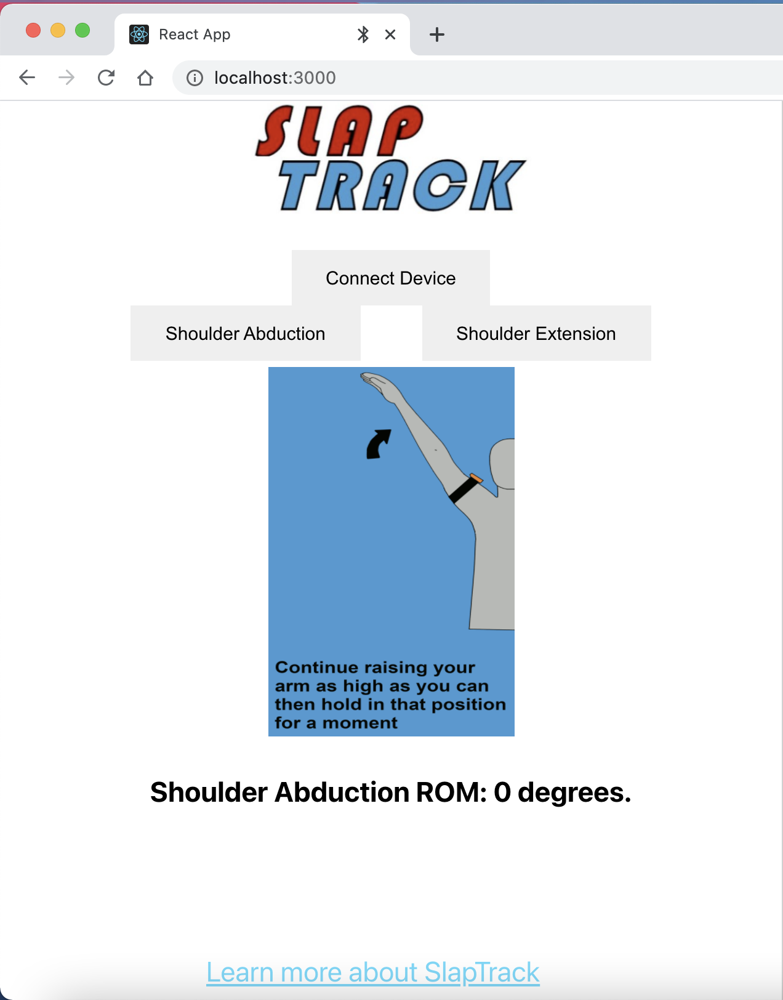

# SlapTrack

## Introduction
SlapTrack is an web application connected to a M5Stick-C device via BLE connection to record and store data recorded by the M5Stick-C's 6-axis IMU. 

The app tracks and records the range of movements of the limb in the roll direction of the device; then the application will display the range of motion (ROM) on the mobile portal.

The goal of the device is to gain quantifiable rehabilitation data for stroke patients so that Physical Therapists will have more accurate and easy way to assess patient's progress over time, giving better rehabilitation outcomes.

SlapTrack is BMedical's senior design project. Teammates include: Robert Zhang, Ryan Homem, Ponni Theetharappan, Kyle Wysocki.

## Equipment list
- M5Stick-C [https://shop.m5stack.com/products/stick-c]
- 3D Printed Base Mold
- Slap Band of any sort

## Software Tools
- Visual Studio Code
- Arduino IDE / Platformio

## Start
To start testing the device, you'll need to first download the repo.

Then:

`cd mobile-app`

utilizing either Arduino IDE or Platformio frm VSCode, build and upload the script to the M5Stick-C device. 

Then:

`cd ..`

`cd host-app`

`npm start`

This will start a local host of application at `localhost:3000` (default).

On the website above, click "Connect Device" to conect to M5Stick-C BLE server. And then click "Shoulder Abduction" and follow the GIF displayed on the website. After the exercise the website will automatically display the ROM of your exercise. To repeat an exercise, simply click the "Shoulder Abduction" button again. 

## Acknowledgements
This project is mentored by Dr. Andy McDaniel and Dr. Bruce Wiggin from the UNC&NCSU BME Department. This project is also funded by the UNC&NCSU BME Department. Huge thanks were given to the mentors and the support from the department.  

